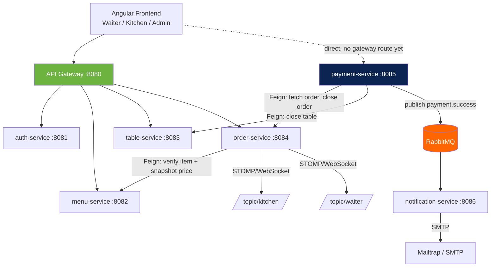
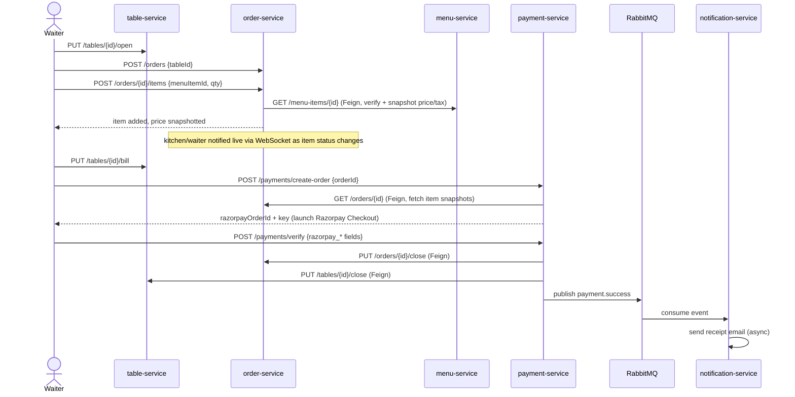

# 🍽️ Restaurant POS — Microservices Backend

> A Spring Boot microservices backend for a full restaurant point-of-sale system — order-taking, kitchen workflow, payments, and notifications — built end-to-end as a 4-day sprint.


---

## 📑 Table of contents

- [Architecture at a glance](#-architecture-at-a-glance)
- [Services](#-services)
- [End-to-end flow](#-end-to-end-flow-table-to-receipt)
- [Folder structure convention](#-folder-structure--the-convention-every-service-follows)
- [Worked example: order-service](#-worked-example-order-service)
- [Cross-cutting design choices](#-cross-cutting-design-choices-apply-to-every-service)
- [Secrets & environment variables](#-secrets--environment-variables)
- [Build timeline](#-build-timeline)
- [Known limitations](#-known-limitations-intentional-scope-cuts-not-bugs)

---

## 🏗️ Architecture at a glance



Each service owns its own MySQL schema — no shared tables, no cross-service joins. All inter-service calls are synchronous HTTP (Feign) **except** payment → notification, which is async over RabbitMQ.

---

## 🐳 Running with Docker

The entire microservice architecture (including the Angular frontend, MySQL, and RabbitMQ) is fully Dockerised and can be launched with a single command.

1. Ensure Docker Desktop is running.
2. From the root `restaurant` directory, run:
   ```bash
   docker-compose up -d --build
   ```
3. Access the frontend at `http://localhost:4200` and the API Gateway at `http://localhost:8080`.

---

## 🧩 Services

| Service | Port | Database | Responsibility |
|---|---|---|---|
| 🔐 **auth-service** | `8081` | `pos_auth` | Registration, login, JWT issuing |
| 🍕 **menu-service** | `8082` | `pos_menu` | Menu item CRUD, availability flags |
| 🪑 **table-service** | `8083` | `pos_table` | Table state machine (`AVAILABLE → OCCUPIED → BILLED → AVAILABLE`) |
| 🧾 **order-service** | `8084` | `pos_order` | Orders, order items, live kitchen/waiter WebSocket push |
| 💳 **payment-service** | `8085` | `pos_payment` | Razorpay integration, closes order + frees table on success |
| ✉️ **notification-service** | `8086` | — | RabbitMQ consumer, async receipt email |
| 🚪 **api-gateway** | `8080` | — | Single entry point, routes to every service above (except payments, see [limitations](#-known-limitations-intentional-scope-cuts-not-bugs)) |

---

## 🔄 End-to-end flow: table to receipt



---

## 📁 Folder structure — the convention every service follows

Every service (except `notification-service` — see below) follows the same package skeleton, regardless of how simple it is:

```
com.pos.<service>/
├── 📂 config/        — SecurityConfig, FeignConfig, RabbitMQConfig, WebSocketConfig, etc.
├── 📂 controller/     — REST controllers
├── 📂 service/        — interface + impl/ subpackage, always split, never one class
├── 📂 repository/     — JpaRepository interfaces
├── 📂 entity/         — JPA entities (Lombok @Data @Builder, never hand-written boilerplate)
├── 📂 dto/            — Create/Update request DTOs + Response DTOs, never the entity itself
├── 📂 client/         — Feign client interfaces + mirrored response DTOs
├── 📂 security/       — JwtUtil, JwtFilter (copied across services, validation-only outside auth-service)
├── 📂 exception/      — thin custom exceptions + one GlobalExceptionHandler
└── 📂 enums/
```

> **Why `notification-service` breaks the pattern:** no `entity`/`repository` (nothing to persist), no `security` (it has no inbound HTTP API — it's woken up by a RabbitMQ message, not a user request, so there's nothing for a JWT filter to protect). The rule is *"follow the skeleton unless the service's actual shape genuinely doesn't fit it,"* not *"force-fit it everywhere."*

---

## 🔍 Worked example: `order-service`

Chosen as the example because it's the most structurally complete service — it has its own CRUD, calls another service via Feign, and pushes real-time events over WebSocket.

```
order-service/
├── pom.xml
├── README.md
└── src/main/java/com/pos/order/
    ├── 📄 OrderServiceApplication.java
    ├── 📂 config/
    │   ├── SecurityConfig.java       — URL-level RBAC rules, JWT filter chain
    │   ├── FeignConfig.java          — forwards caller's JWT to menu-service
    │   └── WebSocketConfig.java      — STOMP/SockJS setup, /topic/kitchen + /topic/waiter
    ├── 📂 controller/
    │   └── OrderController.java
    ├── 📂 service/
    │   ├── OrderService.java         — interface
    │   └── impl/OrderServiceImpl.java
    ├── 📂 repository/
    │   ├── OrderRepository.java
    │   └── OrderItemRepository.java
    ├── 📂 entity/
    │   ├── Order.java
    │   └── OrderItem.java
    ├── 📂 dto/
    │   ├── CreateOrderRequest.java
    │   ├── AddItemRequest.java
    │   ├── UpdateItemStatusRequest.java
    │   ├── OrderResponse.java
    │   ├── OrderItemResponse.java
    │   └── ItemStatusEvent.java      — WebSocket broadcast payload
    ├── 📂 client/
    │   ├── MenuServiceClient.java    — Feign interface
    │   └── MenuItemResponse.java     — mirrors menu-service's response shape
    ├── 📂 security/
    │   ├── JwtUtil.java              — validation-only (no generateToken)
    │   └── JwtFilter.java
    ├── 📂 exception/
    │   ├── ResourceNotFoundException.java
    │   ├── InvalidMenuItemException.java
    │   ├── InvalidOrderStateException.java
    │   └── GlobalExceptionHandler.java
    └── 📂 enums/
        ├── OrderStatus.java
        └── ItemStatus.java
```

### ✨ Features

- Full order/item CRUD, built and tested in isolation before any cross-service calls were added.
- **Live menu verification** — adding an item calls menu-service via Feign to confirm it exists and is available, and snapshots its `name`/`price`/`taxRate` onto the order item at that moment. Those snapshots never change even if the menu item's price changes later.
- **Real-time push** — every item add and status change broadcasts to `/topic/kitchen`; an item becoming `READY` additionally broadcasts to `/topic/waiter`.
- **Idempotent order closing** — `PUT /orders/{id}/close`, called by payment-service after a verified payment. Calling it twice doesn't error, it just returns the already-closed order.

### 🎯 Design choices worth calling out

| Choice | Why |
|---|---|
| Service layer always interface + impl | Controllers depend on the contract, not the implementation — even with only one impl, keeps the seam available |
| Snapshot pattern over live lookups | `priceAtOrderTime`/`taxRateAtOrderTime` are captured once at add-time. This is what lets payment-service compute totals without a second live Feign call — it just trusts the stored snapshot |
| Explicit Feign config reference | `@FeignClient(configuration = FeignConfig.class)` instead of relying on OpenFeign's implicit global-interceptor behavior — explicit over implicit |
| No WebSocket-level auth | `/ws/**` is `permitAll` — a conscious sprint-timeline simplification, flagged as a hardening item before any real deployment |
| Belt-and-suspenders RBAC | Every write endpoint restricted twice: once in `SecurityConfig`'s URL matchers, once via `@PreAuthorize`. If one layer is ever loosened by mistake, the other still holds |

---

## ⚙️ Cross-cutting design choices (apply to every service)

- 🧬 **Lombok everywhere** on entities/DTOs (`@Data @Builder @NoArgsConstructor @AllArgsConstructor`) — no hand-written getters/setters/constructors.
- 🗺️ **Manual `toResponse()` mappers** inside each `ServiceImpl`, no MapStruct — deliberately explicit over a mapping library.
- 🚨 **One `GlobalExceptionHandler` per service**, consistent JSON error shape: `{ "timestamp", "status", "error" }` (plus a `fields` map for validation errors).
- 🔑 **`JwtUtil`/`JwtFilter` copied verbatim** across every non-auth service, with `generateToken()` stripped — only auth-service issues tokens, everyone else only validates.
- 🗄️ **`createDatabaseIfNotExist=true`** on every datasource URL — schemas auto-create on first connection, no manual setup step.
- 🔁 **Service-to-service auth has no single universal answer.** Where a call happens *inside* an existing user request (order→menu, payment→order/table), the caller's JWT gets forwarded via a Feign interceptor. Where there's no user request to forward from (notification-service's RabbitMQ listener), that pattern doesn't apply — the data has to be resolved *upstream*, before the async handoff.

---

## 🔐 Secrets & environment variables

Every service follows the same pattern: sane local-dev defaults baked into `application.yml`, all overridable via env var, nothing real ever committed.

| Variable | Used by | Notes |
|---|---|---|
| `JWT_SECRET` | every service | Must be **identical** across all of them — one shared signing secret, not per-service |
| `DB_USER` / `DB_PASSWORD` / `DB_NAME` | every DB-backed service | `DB_NAME` defaults differently per service (`pos_auth`, `pos_menu`, …) — don't override two services to the same value |
| `RAZORPAY_KEY_ID` / `RAZORPAY_KEY_SECRET` | payment-service | Test-mode keys from the Razorpay Dashboard. Never commit real values |
| `RABBITMQ_HOST` / `RABBITMQ_PORT` / `RABBITMQ_USER` / `RABBITMQ_PASSWORD` | payment-service (publisher), notification-service (consumer) | Both must point at the **same** broker instance |
| `MAIL_HOST` / `MAIL_PORT` / `MAIL_USERNAME` / `MAIL_PASSWORD` | notification-service | SMTP credentials — Mailtrap (sandbox) for dev |
| `MENU_SERVICE_URL` / `ORDER_SERVICE_URL` / `TABLE_SERVICE_URL` | whichever service Feign-calls that target | Defaults assume all services on `localhost` at standard ports |

> ⚠️ **The one thing every service shares and must match exactly:** `JWT_SECRET`. If even one service has a different value, that service silently rejects every token issued by auth-service — and the failure mode is a confusing `401`/`403`, not an obvious config error. Check this first if a service starts rejecting all authenticated requests.

---

## 🗓️ Build timeline

| Day | Focus | Outcome |
|---|---|---|
| **Day 1** | auth-service, menu-service, table-service | Three independently-tested services, full RBAC, JWT issuing/validation |
| **Day 2** | order-service + API Gateway | First service-to-service call (Feign), live menu verification, gateway routing |
| **Day 3** | payment-service, WebSocket, notification-service | Real Razorpay integration, STOMP push to kitchen/waiter, async email via RabbitMQ |
| **Day 4** | Angular frontend *(planned)* | Waiter Terminal → Kitchen Display → Admin Dashboard |
| **Day 5** | Dockerisation | Containerised all 8 services, database, and message broker into a unified `docker-compose` environment |

---

## 🚧 Known limitations *(intentional scope cuts, not bugs)*

- [ ] No gateway route for `/payments/**` yet — payment-service is reached directly on `8085`
- [ ] No "list all orders" / "list all payments" admin/history endpoints
- [ ] `ItemStatus` transitions are unenforced (any status can follow any other) — unlike table-service's strict state machine
- [ ] notification-service's recipient email is a placeholder, pending a small auth-service addition (`GET /auth/users/{id}`) that hasn't been wired up yet
- [ ] WebSocket endpoint has no authentication — fine for local dev, needs hardening before any real deployment
